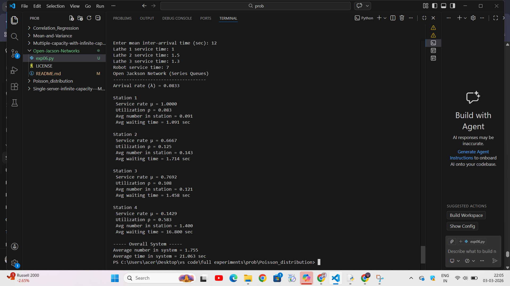

# Series Queues with infinite capacity - Open Jackson Network
# DATE :03.03.2026
## Aim :
To find (a) average number of materials in the system (b) average number of materials in the each conveyor of (c) waiting time of each material in the system (d) waiting time of each material in each conveyor, if the arrival  of materials follow Poisson process with the mean interval time 12 seconds, service time of  lathe machine in series follow exponential distribution  with service time  1 second, 1.5 seconds and 1.3 seconds respectively and average service time of robot is 7 seconds.

## Software required :
Visual components and Python

## Theory


## Procedure :


## Program
```
# Open Jackson Network (Series Queues)

arr_time = float(input("Enter mean inter-arrival time (sec): "))

service_times = [
    float(input("Lathe 1 service time: ")),
    float(input("Lathe 2 service time: ")),
    float(input("Lathe 3 service time: ")),
    float(input("Robot service time: "))
]

lam = 1/arr_time 

print("Open Jackson Network (Series Queues)")
print("-----------------------------------")
print(f"Arrival rate (λ) = {lam:.4f}\n")

total_L = 0
total_W = 0

for i, s in enumerate(service_times):

    mu = 1/s
    rho = lam/mu

    if rho >= 1:
        print(f"Station {i+1} is UNSTABLE")
        exit()

    L = lam/(mu-lam)
    W = 1/(mu-lam)

    total_L += L
    total_W += W

    print(f"Station {i+1}")
    print(f" Service rate μ = {mu:.4f}")
    print(f" Utilization ρ = {rho:.3f}")
    print(f" Avg number in station = {L:.3f}")
    print(f" Avg waiting time = {W:.3f} sec\n")

print("----- Overall System -----")
print(f"Average number in system = {total_L:.3f}")
print(f"Average time in system = {total_W:.3f} sec")

```
## Output

## Result
Hence the problem is solved and obtained output with Python